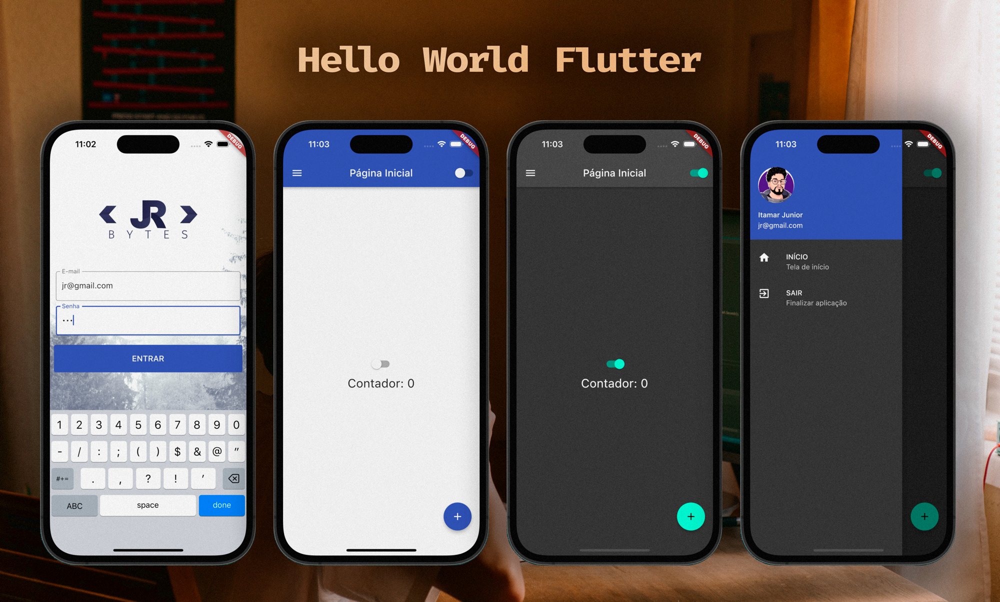

# Hello World Flutter

Comecei aprender Dart e Flutter, vendo os conteúdos do canal Flutterando. Por mais simples que sejam os projetos, irei criar um repositório para armazena-los. Dessa forma, posso acompanhar o meu progresso e também compartilhar com vocês.

Esse é um exemplo diferente de Hello World, onde tem uma tela de login e um Switcher para alterar o tema light ou dark.